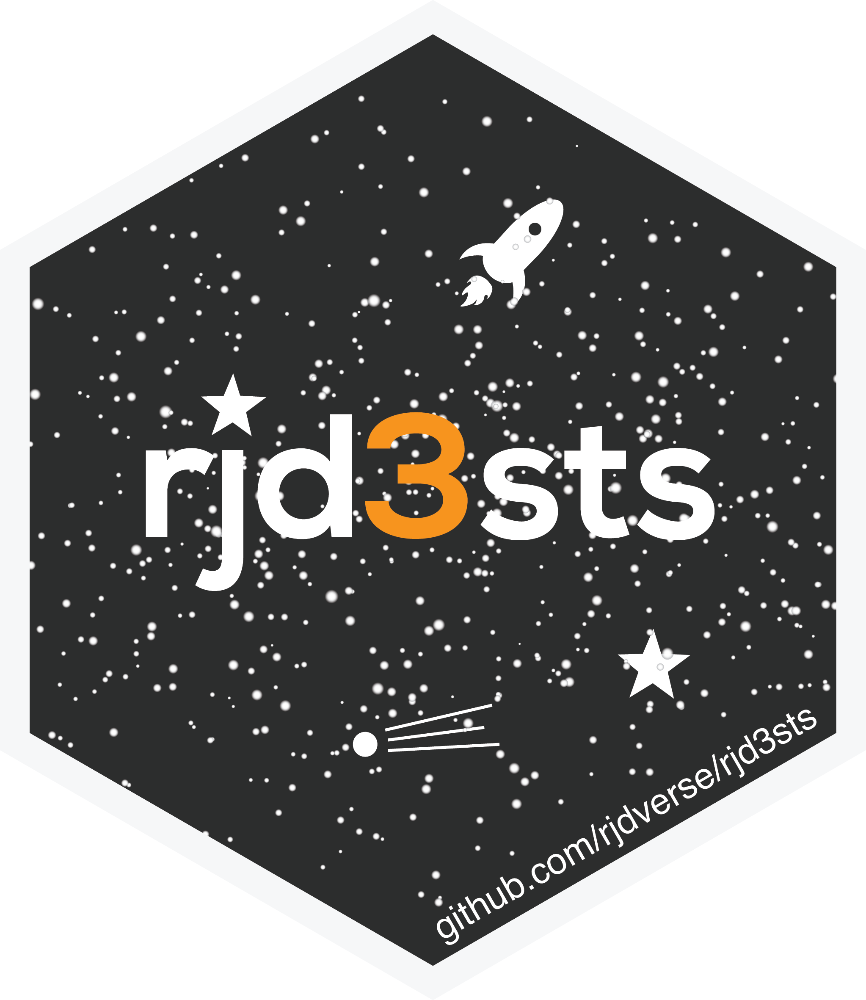
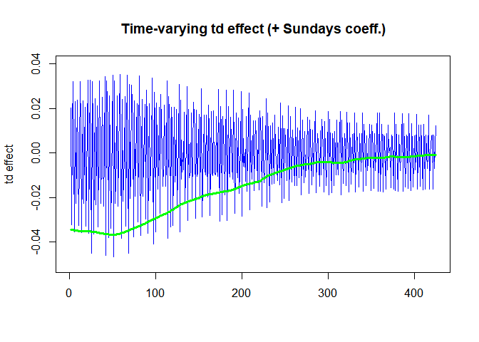

<!-- README.md is generated from README.Rmd. Please edit that file -->

# `rjd3sts` <a href="https://rjdverse.github.io/rjd3sts/"></a>

<!-- badges: start -->

[](https://CRAN.R-project.org/package=rjd3sts)

[](https://github.com/rjdverse/rjd3sts/actions/workflows/R-CMD-check.yaml)
[](https://github.com/rjdverse/rjd3sts/actions/workflows/lint.yaml)

[](https://github.com/rjdverse/rjd3sts/actions/workflows/pkgdown.yaml)
<!-- badges: end -->

## Installation

Running rjd3 packages requires **Java 17 or higher**. How to set up such
a configuration in R is explained
[here](https://jdemetra-new-documentation.netlify.app/#Rconfig)

### Latest release

To get the current stable version (from the latest release):

- From GitHub:

``` r
# install.packages("remotes")
remotes::install_github("rjdverse/rjd3toolkit@*release")
remotes::install_github("rjdverse/rjd3sts@*release")
```

- From [r-universe](https://rjdverse.r-universe.dev/rjd3sts):

``` r
install.packages("rjd3sts", repos = c("https://rjdverse.r-universe.dev", "https://cloud.r-project.org"))
```

### Development version

You can install the development version of **rjd3sts** from
[GitHub](https://github.com/) with:

``` r
# install.packages("remotes")
remotes::install_github("rjdverse/rjd3sts")
```

## Usage

``` r
library("rjd3sts")
#> 
#> Attaching package: 'rjd3sts'
#> The following objects are masked from 'package:stats':
#> 
#>     ar, arima, cycle

y <- log(rjd3toolkit::ABS$X0.2.09.10.M)
days<-c(1,1,1,1,2,3,0)

model<-rjd3sts::model()
sarima<-rjd3sts::sarima('arima', 12, orders=c(0,1,1), seasonal=c(0,1,1))
td<-rjd3sts::reg_td('td', 12, start(y), length(y), variance=1, fixed=FALSE)

rjd3sts::add(model, sarima)
rjd3sts::add(model, td)

rslt<-rjd3sts::estimate(model, y)
cmp<-rjd3sts::smoothed_components(rslt)
ss<-rjd3sts::smoothed_states(rslt)

plot(cmp[,2], type='l', ylim=c(-0.05, 0.04), col='blue', main="Time-varying td effect (+ Sundays coeff.)", xlab="", ylab="td effect")
lines(-rowSums(ss[,15:20]), col='green', lwd = 3)
```



## Package Maintenance and contributing

Any contribution is welcome and should be done through pull requests
and/or issues. pull requests should include **updated tests** and
**updated documentation**. If functionality is changed, docstrings
should be added or updated.

## Licensing

The code of this project is licensed under the [European Union Public
Licence
(EUPL)](https://joinup.ec.europa.eu/collection/eupl/eupl-text-eupl-12).
