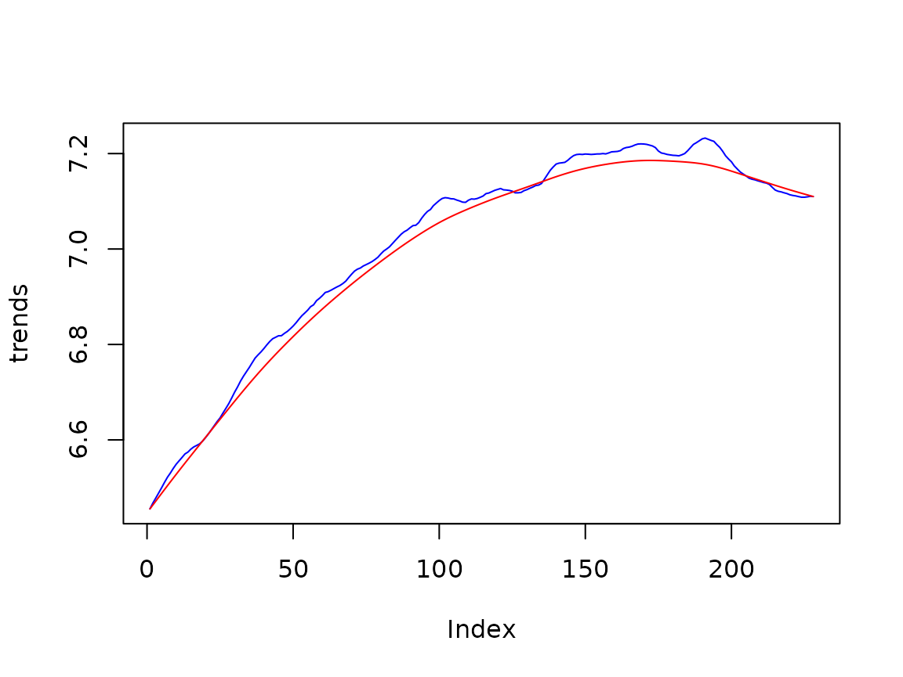

# BSM

## Defining a Basic Structural Model with rjd3sts

The package allows several equivalent definitions of a basic structural
model. We present below some of them.

To compare the results (more precisely the likelihood) of the different
approaches, it is important to compute the marginal likelihood.

``` r
s<-log(Retail$BookStores)
```

### Standard definition, noise in the state

``` r
# create the model
bsm<-model()
# create the components and add them to the model
add(bsm, locallineartrend("ll"))
add(bsm, seasonal("s", 12, type="HarrisonStevens"))
add(bsm, noise("n"))
rslt<-estimate(bsm, s, marginal=TRUE)
```

- Likelihood = 327.0607937
- Parameters = 0.168604, 0.000382, 0.271294, 1.000000

### Standard definition, noise in the measurement

``` r
# create the model
bsm<-model()
# create the components and add them to the model
add(bsm, locallineartrend("ll"))
add(bsm, seasonal("s", 12, type="HarrisonStevens"))
  # create the equation (fix the variance to 1)
eq<-equation("eq", 1,TRUE)
add_equation(eq, "ll")
add_equation(eq, "s")
add(bsm, eq)
rslt<-estimate(bsm, s, marginal=TRUE)
```

- Likelihood = 327.0607937
- Parameters = 0.168604, 0.000382, 0.271294, 1.000000

### components with fixed variances, aggregated with diffuse weights (noise in the state)

``` r
# create the model
bsm<-model()
  # create the components, with fixed variances, and add them to the model
add(bsm, locallineartrend("ll",
                             levelVariance = 1, fixedLevelVariance = TRUE))
add(bsm, seasonal("s", 12, type="HarrisonStevens",
                     variance = 1, fixed = TRUE))
add(bsm, noise("n", 1, fixed=TRUE))
  # create the equation (fix the variance to 1)
eq<-equation("eq", 0, TRUE)
add_equation(eq, "ll", .01, FALSE)
add_equation(eq, "s", .01, FALSE)
add_equation(eq, "n")
add(bsm, eq)
rslt<-estimate(bsm, s, marginal=TRUE)
p<-result(rslt, "parameters")
```

- Likelihood = 327.0607937
- Parameters = 1.0000, 0.0023, 1.0000, 1.0000, 0.4106, 0.5209

To be noted:

- Level variance = $p\lbrack 5\rbrack \times p\lbrack 5\rbrack$ =
  0.168617
- Slope variance =
  $p\lbrack 5\rbrack \times p\lbrack 5\rbrack \times p\lbrack 2\rbrack$
  = 0.000382
- Seas variance = $p\lbrack 6\rbrack \times p\lbrack 6\rbrack$ =
  0.271315

### bsm with long term trend and cycle

``` r
# create the model
bsm<-model()
  # create the components and add them to the model
add(bsm, locallevel("l", initial = 0))
add(bsm, locallineartrend("lt", levelVariance = 0,
                             fixedLevelVariance = TRUE))
add(bsm, seasonal("s", 12, type="HarrisonStevens"))
add(bsm, noise("n", 1, fixed=TRUE))
  # create the equation (fix the variance to 1)
rslt<-estimate(bsm, s, marginal=TRUE)
```

- Likelihood = 327.0607937
- Parameters = 0.168604, 0.000000, 0.000382, 0.271294, 1.000000

``` r
ss<-smoothed_states(rslt)
plot(ss[,1]+ss[,2], type='l', col='blue', ylab='trends')
lines(ss[, 2], col='red')
```


