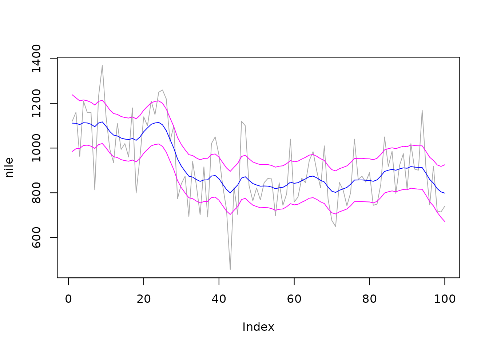

# Modeling Nile riverflow

## Introduction

This document reproduces with rjd3sts the example N°4 of the paper:

*Bell W.R. (2011). REGCMPNT - A Fortran Program for Regression Models
with ARIMA Component Errors. Journal of Statistical Software. Volume 41,
Issue 7.*

Details on the considered model can be retrieved from the original paper
(pages 8-11).

### Definition of the model in rjd3sts

We consider two models strictly equivalent, the first one based on ARIMA
models and the second one based on common BSM blocks. To be noted that
the state space representations of those approaches are not always the
same.

``` r

# create the UCARIMA model
model1<-rjd3sts::model()
# create the components and add them to the model
rjd3sts::add(model1, rjd3sts::sarima("d1", period=1, orders=c(0,1,0), seasonal = c(0,0,0)))
rjd3sts::add(model1, rjd3sts::sarima("n", period=1, orders=c(0,0,0), seasonal = c(0,0,0)))

rslt1<-rjd3sts::estimate(model1, nile)

# create the BSM model
model2<-rjd3sts::model()
# create the components and add them to the model
rjd3sts::add(model2, rjd3sts::locallevel("l"))
rjd3sts::add(model2, rjd3sts::noise("n"))

rslt2<-rjd3sts::estimate(model2, nile)
```

### Main results

#### UCARIMA model

$`\sigma_1^2=`$ 1469.1797008

$`\sigma_2^2=`$ 15098.5122425

#### BSM model

$`\sigma_1^2=`$ 1469.1797108

$`\sigma_2^2=`$ 15098.5122242

### Trend estimates

``` r

q1<-rjd3sts::smoothed_components(rslt1)
qe1<-rjd3sts::smoothed_components_stdev(rslt1)

plot(nile, type='l', col="darkgray")
lines(q1[,1], col="blue")

lines(q1[,1]+qe1[,1]*2, col="magenta")
lines(q1[,1]-qe1[,1]*2, col="magenta")
```


