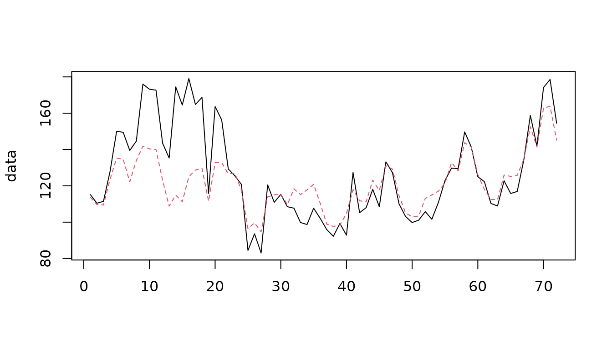
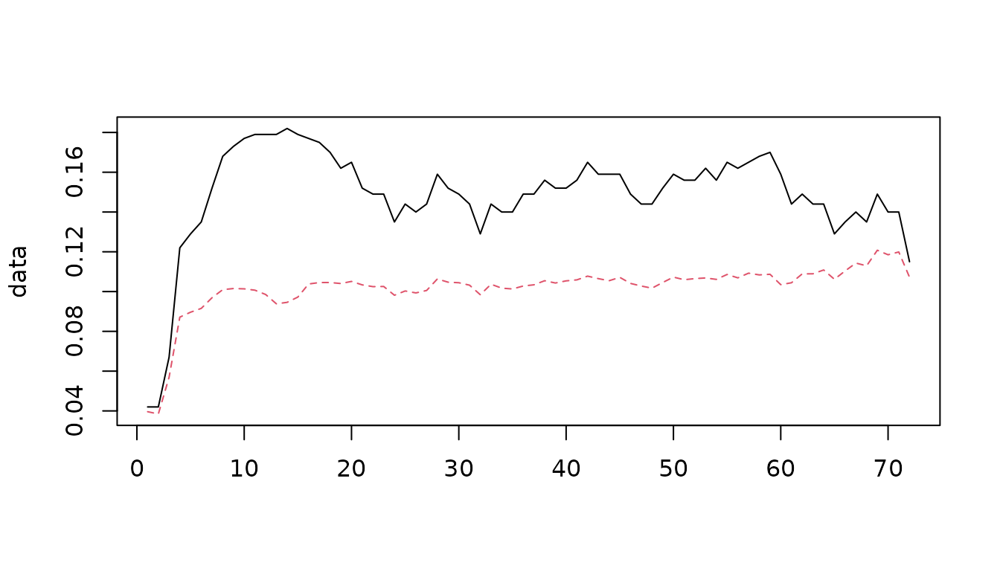

# Time series with a sampling error component

## Introduction

This document reproduces with rjd3sts the example N°6 of the paper:

*Bell W.R. (2011). REGCMPNT - A Fortran Program for Regression Models
with ARIMA Component Errors. Journal of Statistical Software. Volume 41,
Issue 7.*

Details on the considered model can be retrieved from the original paper
(pages 17-20).

### Definition of the model in rjd3sts

Remark: the code presented below will be further simplified (the
definition of the equation will be suppressed, as it is already the case
for non-weighted state components).

``` r

y<-log(nr055)

# create the model
model<-rjd3sts::model()
# create the components and add them to the model

# airline block
airline<-rjd3sts::sarima("airline", 12, c(0,1,1), c(0,1,1))
# fixed AR model for the sampling error
ar<-rjd3sts::ar("ar", ar=c(0.6, 0.246), fixedar=TRUE, variance=0.34488, fixedvariance=TRUE)

rjd3sts::add(model, airline)
rjd3sts::add(model, ar)

# creation of the unique equation
eq<-rjd3sts::equation("eq")
rjd3sts::add_equation(eq, "airline")
rjd3sts::add_equation(eq, "ar", loading = rjd3sts::var_loading(pos=0, weights = h))
rjd3sts::add(model, eq)

# estimate the model
# it is important to note that we don't use the concentrated likelihood (which is the default option,
# faster and more stable)
# In this case the optimization procedure is BFGS instead of Levenberg-Marquardt.

rslt<-rjd3sts::estimate(model, y, concentrated=FALSE)
```

### Main results

#### Estimated parameters

    #> Airline:
    #> Innovation variance:  0.005302598
    #> theta:  -0.4695642
    #> btheta:  -0.4222849

#### Original series (solid) and signal extraction estimates (dashed)

``` r

data<-cbind(nr055, exp(q[,1]))
matplot(data, type='l')
```



#### Signal extraction estimates of the sampling error

``` r
noise<-exp(q[,2])
plot(noise, type='l')
```


#### Sampling error and signal extraction error

``` r
data<-cbind(h, qe[,2])
matplot(data, type='l')
```



#### CV improvement due to signal extraction

``` r
improvement<-(h-qe[,2])/h*100
plot(improvement, type='l')
```


