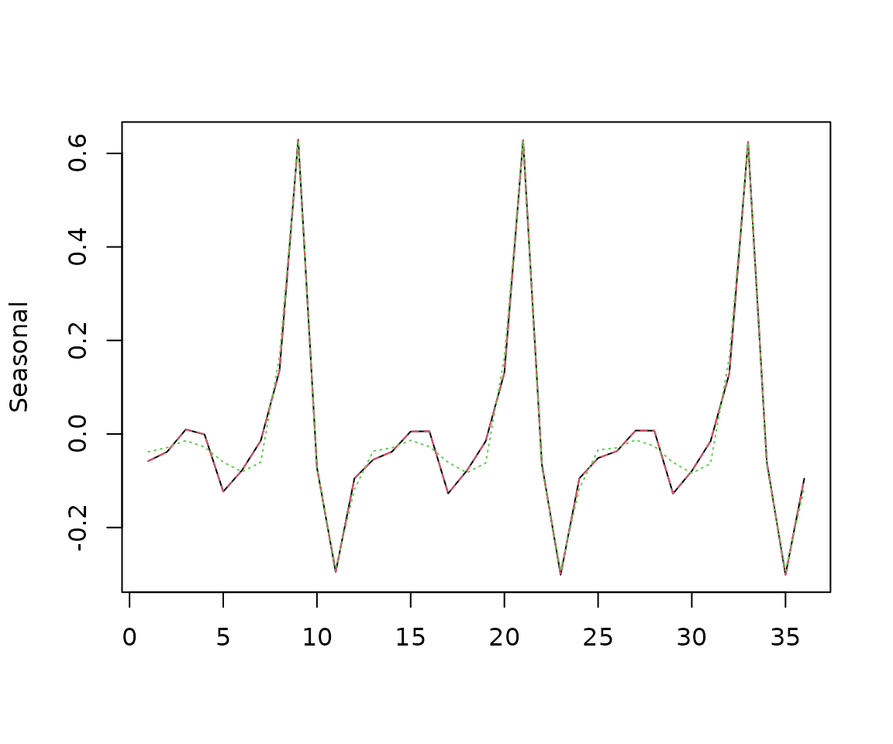

# Regular periodic cubic splines

## Use of regular periodic cubic splines

``` r

s<-log(ABS$X0.2.09.10.M)
```

### Usual BSM with Harrison-Stevens seasonal component

``` r

model<-model()

llt<-locallineartrend('l')
seas<-seasonal("s", 12, "HarrisonStevens")
n<-noise('n')
add(model, llt)
add(model, seas)
add(model, n)

rslt<-estimate(model, s)

sa1<-result(rslt, "ssf.smoothing.components")
```

### BSM with full periodic splines seasonal component

The results of the first two models should be identical (up to numerical
precision)

``` r

model<-model()
seas<-splines_regular("s", 12, knots=c(0:11))
add(model, llt)
add(model, seas)
add(model, n)

rslt<-estimate(model, s)

sa2<-result(rslt, "ssf.smoothing.components")

summary(sa1[,2]-sa2[,2])
#>       Min.    1st Qu.     Median       Mean    3rd Qu.       Max. 
#> -1.181e-07 -1.665e-08 -3.910e-11  8.890e-11  1.603e-08  8.794e-08
```

### BSM with partial periodic splines seasonal component

The splines are computed on 8 points (instead of 12)

``` r

model<-model()
seas<-splines_regular("s", 12, knots=c(1,2,6,7,8,9,10,11))
add(model, llt)
add(model, seas)
add(model, n)

rslt<-estimate(model, s)

sa3<-result(rslt, "ssf.smoothing.components")


matplot(cbind(sa1[301:336,2],sa2[301:336,2],sa3[301:336,2]), type='l', ylab="Seasonal")
```


