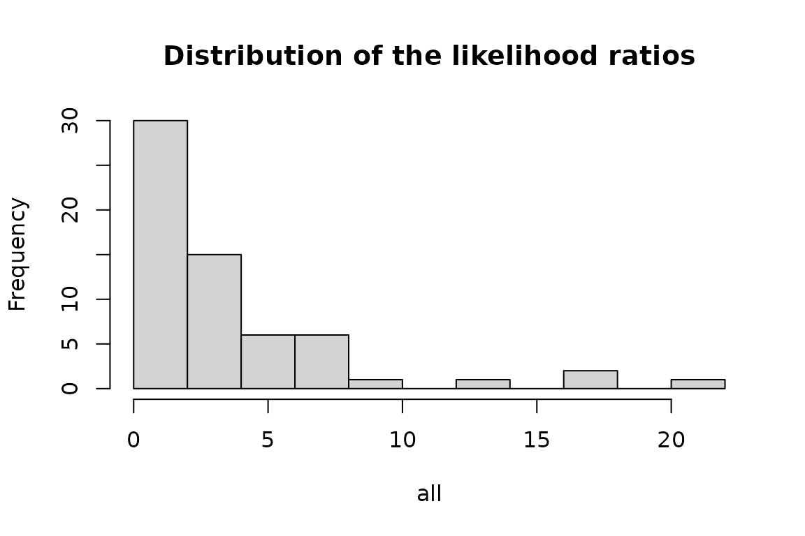
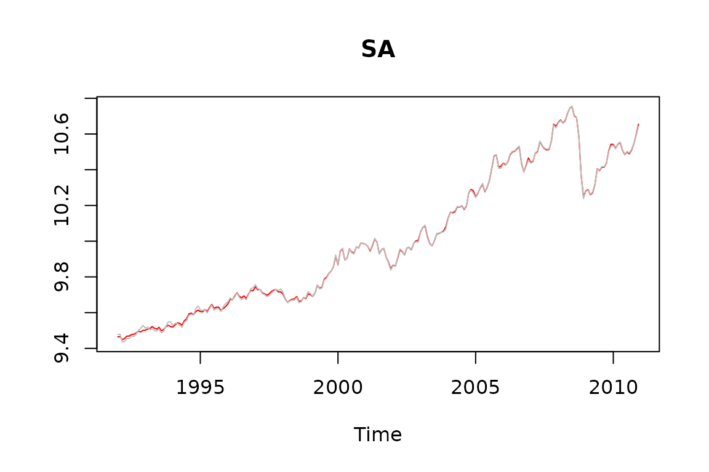
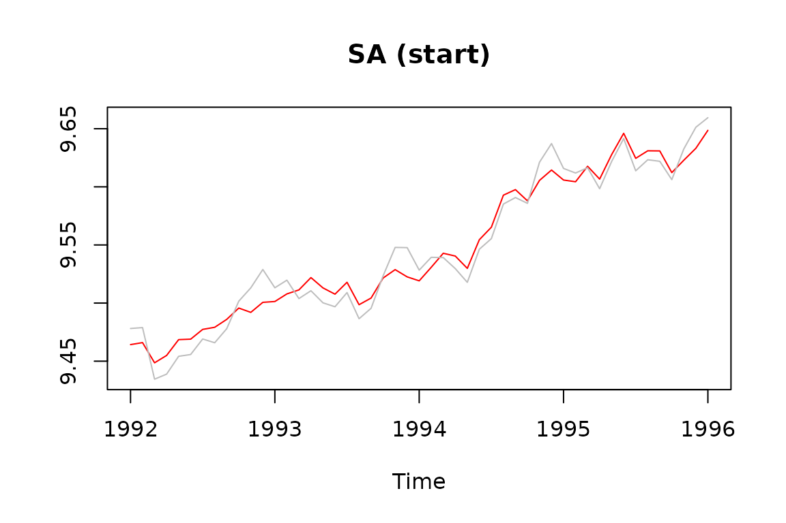
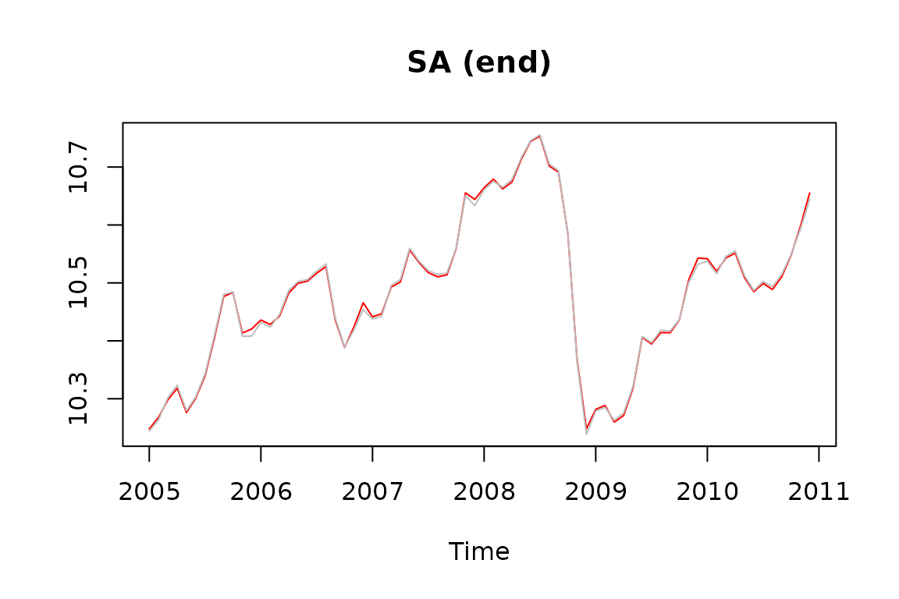
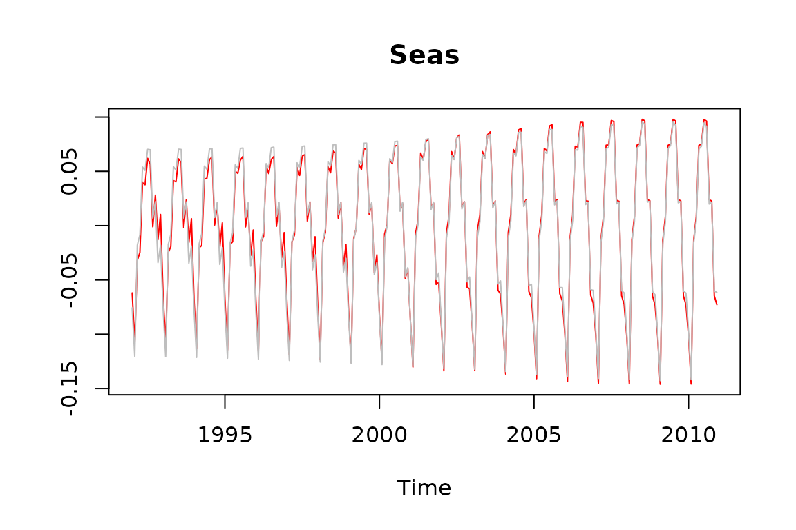
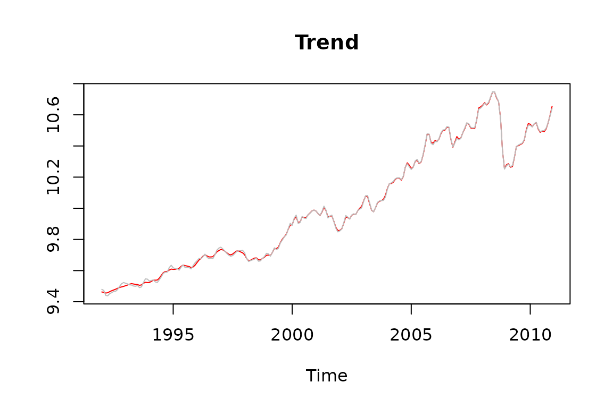
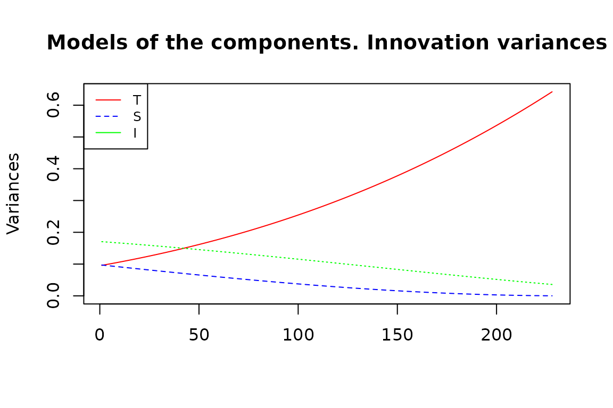

# Time dependent airline model

### Introduction

This document presents some results on time-dependent arima models
developed by G. Melard et al., as they are implemented in JDemetra+ The
current implementation focuses on airline models.

#### Estimation of time-dependent airline models

The likelihood ratios between time-dependent and normal airline models
computed on 62 series of the US-retail trade statistics are presented
below. Likelihood ratios above 4 indicate a significant preference for
the time-dependent models.

``` r
test<-function(z){
  q<-rjd3sts::tdairline_estimation(z)
  return (q$ltd_sarima$likelihood- q$sarima$likelihood)
}

all<-sapply(rjd3toolkit::Retail, function(z) test(z))

hist(all, breaks=10, main="Distribution of the likelihood ratios")
```



``` r
print(all)
#>     AllOtherGenMerchandiseStores    AllOtherHomeFurnishingsStores 
#>                        0.2599687                        1.8073763 
#>        AppltvAndOtherElectStores                AutomobileDealers 
#>                        2.6904441                        7.5012325 
#>          BeerWineAndLiquorStores                       BookStores 
#>                        1.4763512                        2.4879537 
#> BuildingMatAndGardenEquipAndSupp    BuildingMatAndSuppliesDealers 
#>                        1.8481865                        0.9798839 
#>  ClothingAndClothingAccessStores                   ClothingStores 
#>                        3.0727796                        1.9433920 
#>        ComputerAndSoftwareStores DepartmentStoresExclDiscountDepa 
#>                        0.3787791                        7.2711916 
#>           DepartmentStoresExclLD           DepartmentStoresInclLD 
#>                        0.8590355                        0.7634333 
#>         DiscountDeptStoresInclLD               DiscountDeptStores 
#>                        4.8956456                        5.5606961 
#>                   DrinkingPlaces    ElectronicsAndApplianceStores 
#>                        0.6082423                        1.7897230 
#>             FamilyClothingStores              FloorCoveringStores 
#>                        5.3726852                        1.5696636 
#>            FoodAndBeverageStores    FoodServicesAndDrinkingPlaces 
#>                        5.9461737                        0.5840378 
#>                      FuelDealers           FullServiceRestaurants 
#>                        0.8083703                        0.2150196 
#> FurnitureAndHomeFurnishingsStore FurnitureHomeFurnElectronicsAndA 
#>                        2.3809754                        2.0432794 
#>                  FurnitureStores                             Gafo 
#>                        1.9144394                        3.8209734 
#>                 GasolineStations         GeneralMerchandiseStores 
#>                       13.9093037                        5.9325953 
#>     GiftNoveltyAndSouvenirStores                    GroceryStores 
#>                        1.4066652                        5.1526660 
#>                   HardwareStores      HealthAndPersonalCareStores 
#>                        0.9931652                        7.3192726 
#>            HobbyToyAndGameStores            HomeFurnishingsStores 
#>                        2.8548124                        3.0032888 
#>         HouseholdApplianceStores                    JewelryStores 
#>                        0.6237299                        1.4549538 
#>       LimitedServiceEatingPlaces               MensClothingStores 
#>                        0.8227719                        0.7571241 
#>      MiscellaneousStoreRetailers      MotorVehicleAndPartsDealers 
#>                        0.7306779                        8.6937372 
#>                    NewCarDealers                NonstoreRetailers 
#>                        6.6432701                        0.7205383 
#> OfficeSuppliesAndStationeryStore OfficeSuppliesStationeryAndGiftS 
#>                        2.3736957                        0.2937239 
#>              OtherClothingStores    OtherGeneralMerchandiseStores 
#>                        1.0651051                        3.4746228 
#>          PaintAndWallpaperStores          PharmaciesAndDrugStores 
#>                        0.4836048                        6.8507426 
#>       RadioTVAndOtherElectStores  RetailAndFoodServicesSalesTotal 
#>                        3.4329575                       17.3490489 
#> RetailSalesTotalExclMotorVehicle                 RetailSalesTotal 
#>                       21.4911139                       17.7320144 
#>                       ShoeStores SportingGoodsHobbyBookAndMusicSt 
#>                        6.3539561                        2.9775295 
#>              SportingGoodsStores SupermarketsAndOtherGroceryExcep 
#>                        0.2488864                        0.1707006 
#>                   UsedCarDealers            UsedMerchandiseStores 
#>                        3.1951571                        3.1441175 
#>     WarehouseClubsAndSuperstores             WomensClothingStores 
#>                        3.0298947                        1.1010737
```

#### Canonical decomposition and estimation of the components by means of the Kalman smoother

We present below the seasonal adjustment of a series (retail trade of
gasoline stations) and the differences between the series based on the
airline model and the time-dependent airline model, using the Kalman
smoother (time-dependent series in red)

``` r


s<-log(rjd3toolkit::Retail$GasolineStations)

q<-rjd3sts::tdairline_estimation(s)

tdss<-rjd3sts::tdairline_decomposition(s, q$ltd_sarima$parameters)
```



#### Main results

##### Airline:

log-likelihood = 400.3207451

$\theta =$ 0.3963676

$\Theta =$ -0.8673957

###### Time-dependent airline

log-likelihood = 413.0957868

$\bar{\theta} =$**0.2413694** \[ -0.1347973, 0.6175361\]

$\bar{\Theta} =$**-0.7274294** \[ -0.4548589, -1\]

###### Canonical decomposition

``` r

airline_decomposition<-function(period, th, bth){
  sarima<-rjd3toolkit::sarima_model("m", period, NULL, 1, th, NULL, 1, bth)
  return (rjd3tramoseats::seats_decompose(sarima))
}

airline_variances<-function(period, th, bth){
  ucm<-airline_decomposition(period, th, bth)
  if (is.null(ucm)) return (c(NA, NA, NA)) else return (c(ucm$components[[1]]$var, 
                                                          ucm$components[[2]]$var, 
                                                          ucm$components[[3]]$var))
}

# Gets the variances of the canonical decomposition for airline models with different parameters
th<-q$ltd_sarima$th
bth<-q$ltd_sarima$bth

vars<-sapply(seq(1, length(th)), function(z){return (airline_variances(12,th[z], bth[z]))})
vars<-t(vars)

matplot(vars, main="Models of the components. Innovation variances", type = 'l', ylab="Variances",col=c("red", "blue", "green"))
legend("topleft", legend=c("T", "S", "I"),
       col=c("red", "blue", "green"), lty=1:2, cex=0.8)
```


