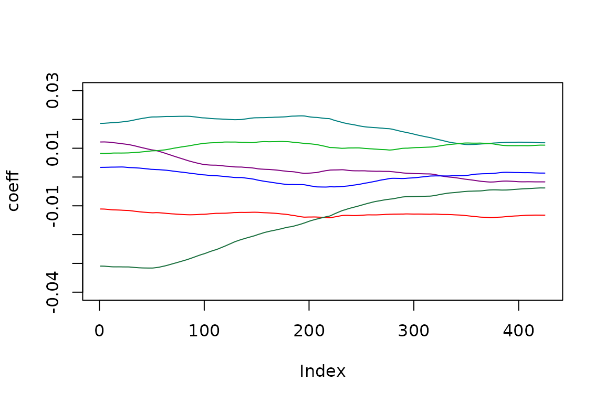
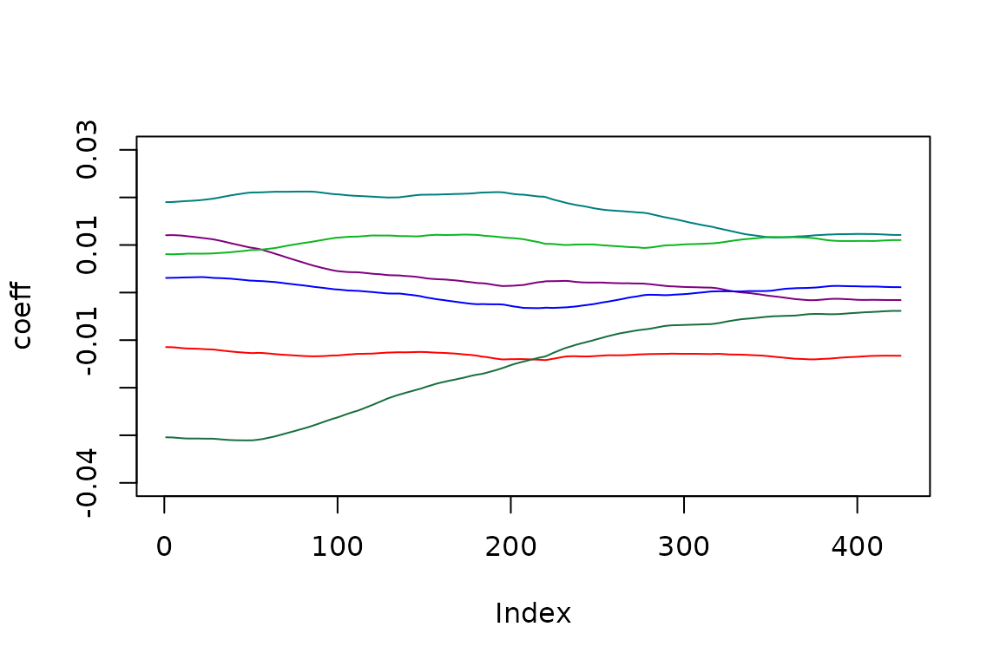

# Time varying trading days

### Introduction

The state space framework allows an easy estimation of time-varying
trading days effects.

``` r

# take a (transformed) series
s<-log(rjd3toolkit::ABS$X0.2.09.10.M)
```

### Modelling

We model such effects by integrating in the state array the regression
coefficients. As usual, the regression variables are modeled by using
contrasts (for instance: \#days-#Sundays). the coefficient follow a
multivariate random walk. As for the usual regression, we put the
constraint that the sum of the coefficients is 0 (which implies that one
coefficient is derived from the others).

To be noted that fixed coefficients correspond to no innovation in the
random walk. We consider that the same innovation variance applies on
the coefficients of each day (option contrast=FALSE) or of each
contrasts (option contrast=TRUE). In this latter case, the variance of
the innovation of the contrasting (group of) days is larger.

Such time varying trading days can be plugged in any representation of
the series.

### SARIMA + TDvar

``` r


# create the model
model<-rjd3sts::model()

# create the components and add them to the model
airline <- rjd3sts::sarima("airline", 12, c(0,1,1), c(0,1,1))
vtd<-rjd3sts::reg_td("td", 12, start(s), length(s), contrast = FALSE)

rjd3sts::add(model, airline)
rjd3sts::add(model, vtd)

#estimate the model
rslt<-rjd3sts::estimate(model, s)

ss<-rjd3toolkit::result(rslt, "ssf.smoothing.states")
vss<-rjd3toolkit::result(rslt, "ssf.smoothing.vstates")
```

### Available results

The results can be retrieved through the “result” function. All the
available information are displayed by means of the “dictionary” method

``` r

print(rjd3toolkit::dictionary(rslt))
#>  [1] "likelihood.ll"                   "likelihood.ser"                 
#>  [3] "likelihood.residuals"            "scalingfactor"                  
#>  [5] "ssf.ncmps"                       "ssf.cmppos"                     
#>  [7] "ssf.cmpnames"                    "parameters"                     
#>  [9] "parametersnames"                 "fn.parameters"                  
#> [11] "ssf.T(*)"                        "ssf.V(*)"                       
#> [13] "ssf.Z(*)"                        "ssf.P0"                         
#> [15] "ssf.B0"                          "ssf.smoothing.array(?)"         
#> [17] "ssf.smoothing.varray(?)"         "ssf.smoothing.cmp(?)"           
#> [19] "ssf.smoothing.vcmp(?)"           "ssf.smoothing.components(?)"    
#> [21] "ssf.smoothing.fastcomponents(?)" "ssf.smoothing.vcomponents(?)"   
#> [23] "ssf.smoothing.state(?)"          "ssf.smoothing.vstate(?)"        
#> [25] "ssf.smoothing.states"            "ssf.smoothing.vstates"          
#> [27] "ssf.filtering.array(?)"          "ssf.filtering.varray(?)"        
#> [29] "ssf.filtering.cmp(?)"            "ssf.filtering.vcmp(?)"          
#> [31] "ssf.filtering.state(?)"          "ssf.filtering.states"           
#> [33] "ssf.filtering.vstates"           "ssf.filtering.vstate(?)"        
#> [35] "ssf.filtered.array(?)"           "ssf.filtered.varray(?)"         
#> [37] "ssf.filtered.cmp(?)"             "ssf.filtered.vcmp(?)"           
#> [39] "ssf.filtered.state(?)"           "ssf.filtered.vstate(?)"         
#> [41] "ssf.filtered.states"             "ssf.filtered.vstates"
```

Time varying trading days

``` r


colfunc<-colorRampPalette(c("red","blue","green","#196F3D"))
colors <- (colfunc(7))

pos<-rjd3toolkit::result(rslt, "ssf.cmppos")
plot(ss[,pos[2]+1], type='l', col=colors[1], ylim=c(-0.04, 0.03), ylab='coeff')
lines(ss[,pos[2]+2], col=colors[2])
lines(ss[,pos[2]+3], col=colors[3])
lines(ss[,pos[2]+4], col=colors[4])
lines(ss[,pos[2]]+5, col=colors[5])
lines(ss[,pos[2]+6], col=colors[6])
lines(-rowSums(ss[,pos[2]+(1:6)]), col=colors[7])
```



### BSM + TDvar

``` r

# take a (transformed) series
s<-log(rjd3toolkit::ABS$X0.2.09.10.M)

# create the model
model<-rjd3sts::model()

# create the components and add them to the model
llt<-rjd3sts::locallineartrend('l')
seas<-rjd3sts::seasonal("s", 12, "HarrisonStevens")
n<-rjd3sts::noise('n')
vtd<-rjd3sts::reg_td("td", 12, start(s), length(s), contrast = FALSE)

rjd3sts::add(model, llt)
rjd3sts::add(model, seas)
rjd3sts::add(model, n)
rjd3sts::add(model, vtd)

#estimate the model
rslt<-rjd3sts::estimate(model, s)

ss<-rjd3toolkit::result(rslt, "ssf.smoothing.states")
vss<-rjd3toolkit::result(rslt, "ssf.smoothing.vstates")
```

Time varying trading days

``` r


colfunc<-colorRampPalette(c("red","blue","green","#196F3D"))
colors <- (colfunc(7))

pos<-rjd3toolkit::result(rslt, "ssf.cmppos")
plot(ss[,pos[4]+1], type='l', col=colors[1], ylim=c(-0.04, 0.03), ylab='coeff')
lines(ss[,pos[4]+2], col=colors[2])
lines(ss[,pos[4]+3], col=colors[3])
lines(ss[,pos[4]+4], col=colors[4])
lines(ss[,pos[4]]+5, col=colors[5])
lines(ss[,pos[4]+6], col=colors[6])
lines(-rowSums(ss[,pos[4]+(1:6)]), col=colors[7])
```


